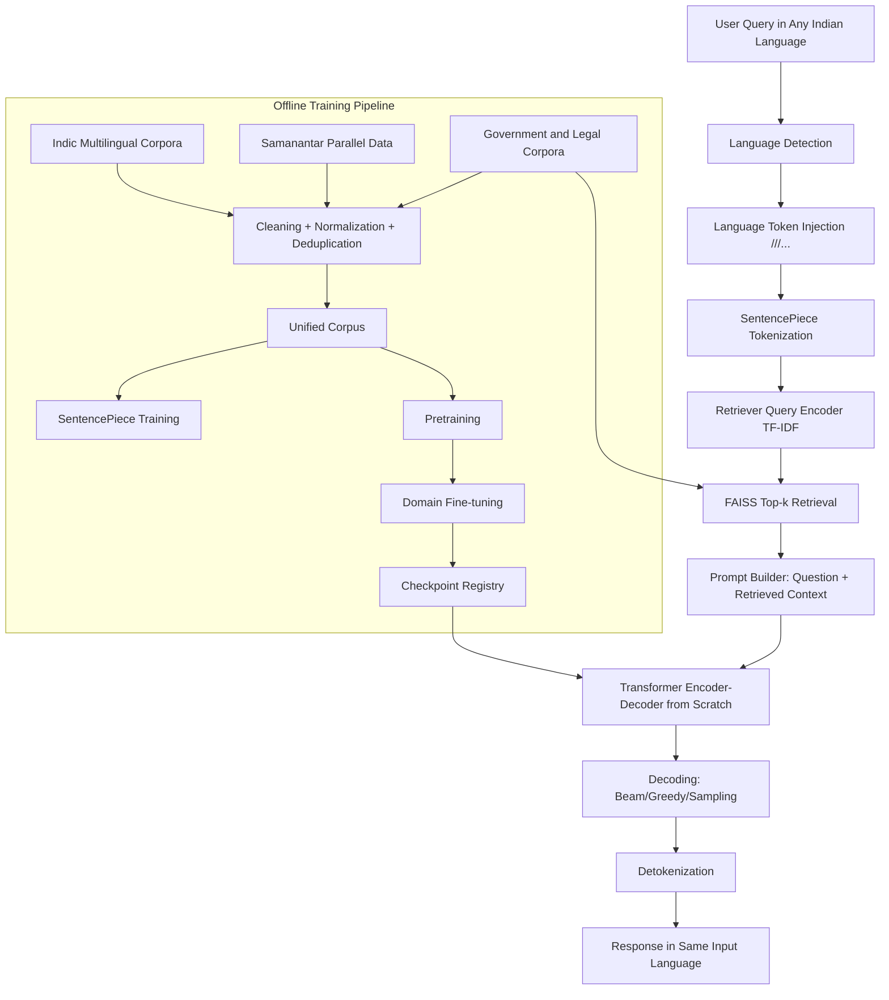

# Thesis-Ready Architecture and Methodology

## System Architecture

## Methodology

### 1. Problem Definition

Build a multilingual chatbot for Indian government services that:

- accepts multiple Indian languages,
- retrieves current domain documents,
- and generates responses in the same language.

### 2. Data Strategy

Use a two-tier corpus:

- Language learning tier: Indic multilingual corpora and parallel sentence pairs.
- Domain adaptation tier: Indian government/legal corpora (acts, bills, schemes, FAQs, circulars).

### 3. Preprocessing

Steps:

1. Unicode normalization (NFKC)
2. whitespace cleanup and punctuation normalization
3. optional near-duplicate filtering
4. language tagging per sample
5. conversion to model-ready seq2seq or causal records

### 4. Tokenization

A shared SentencePiece tokenizer is trained on merged multilingual text with explicit language control tokens.

### 5. Model Design (From Scratch)

The transformer includes:

- token embeddings,
- sinusoidal positional encodings,
- multi-head scaled dot-product attention,
- encoder and decoder stacks,
- masked decoder self-attention,
- feed-forward layers,
- residual + layer normalization.

### 6. Training Stages

1. Pretraining: next-token/autoencoding style multilingual language learning.
2. Fine-tuning: government and legal Q&A/instruction tuning.
3. Optional continual updates: refresh retriever index without full retraining.

### 7. Retrieval-Augmented Generation

Pipeline:

1. chunk domain documents,
2. build vector index,
3. retrieve top-k chunks for each query,
4. append context to prompt,
5. generate response with language token control.

### 8. Evaluation

Core metrics:

- perplexity for language modeling quality,
- BLEU for generation overlap quality,
- retrieval recall@k for evidence coverage.

### 9. Scalability and Stability Plan

- Structured configs for environment-specific tuning.
- Checkpointed training and resumable indexing.
- Batch-oriented data ingestion with glob patterns.
- Decoupled retriever updates from model retraining.
- Offline evaluation script for regression tracking.

### 10. Risks and Mitigation

- Script imbalance across languages: use stratified sampling.
- Domain drift from web updates: periodic index rebuild.
- Hallucinations: always prepend retrieved evidence and enforce source-grounded prompting.
